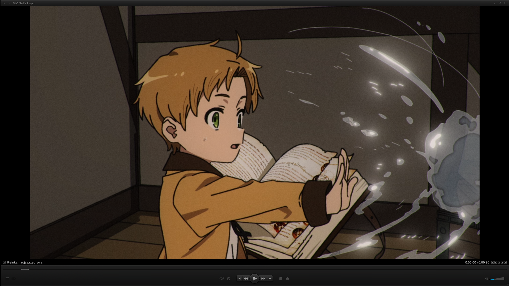
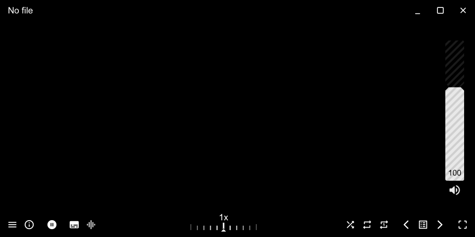
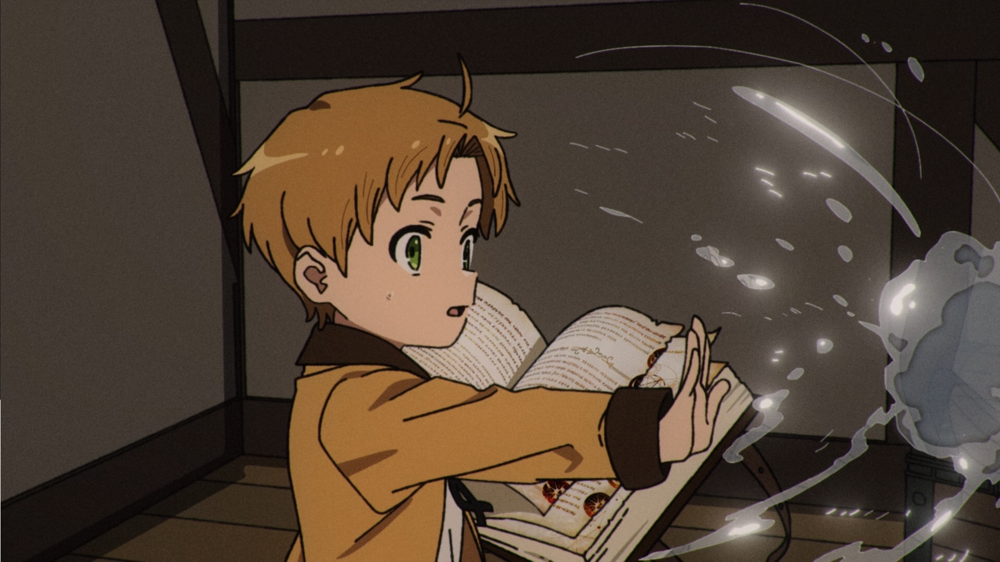
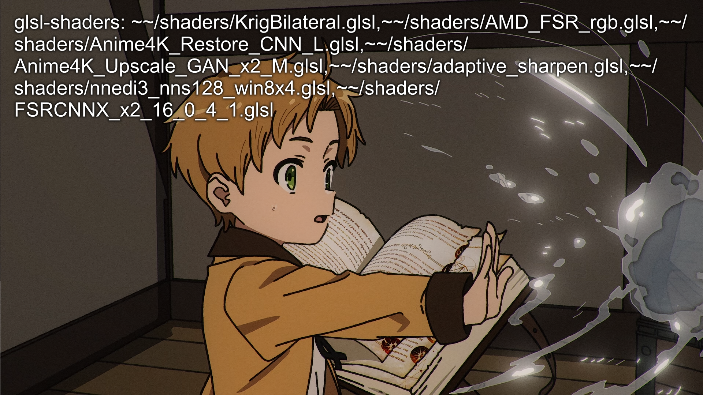
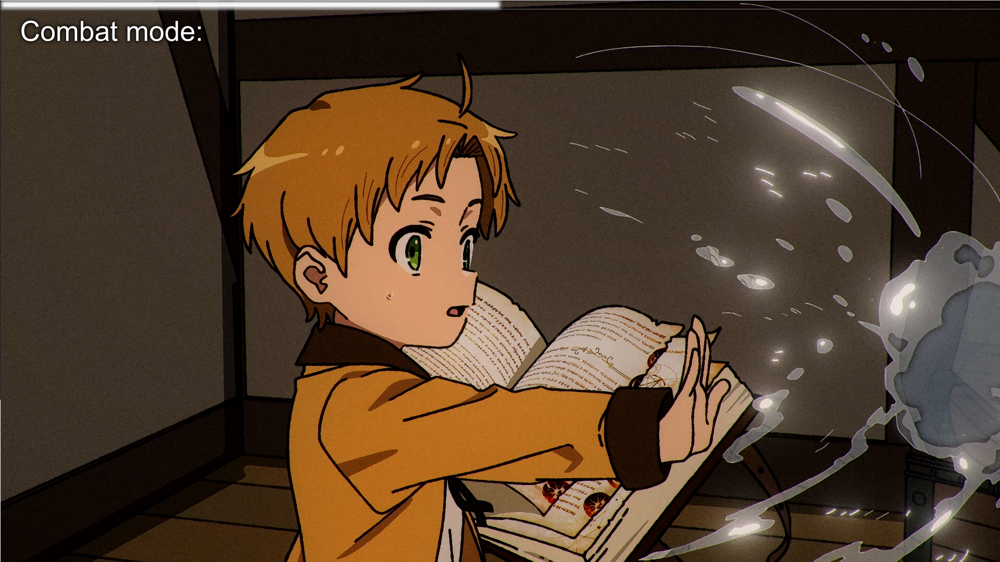
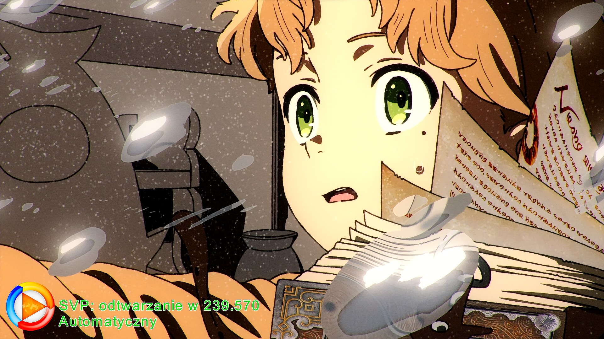
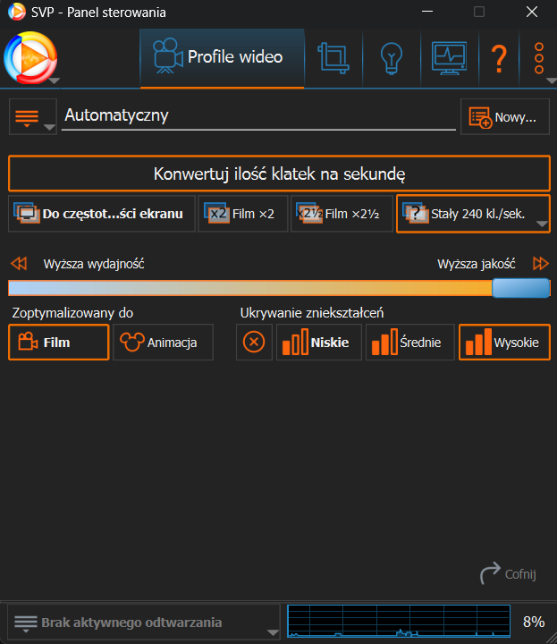
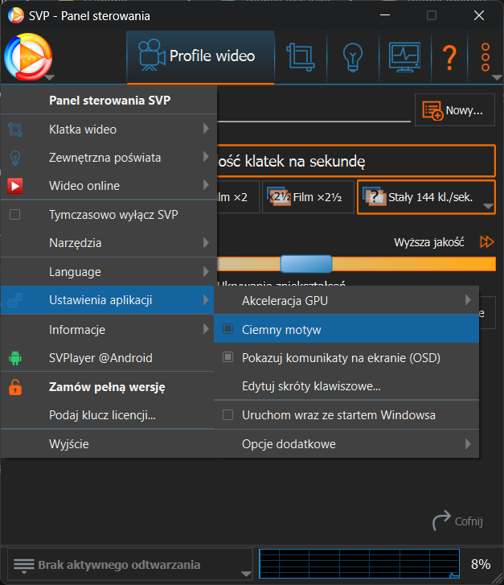
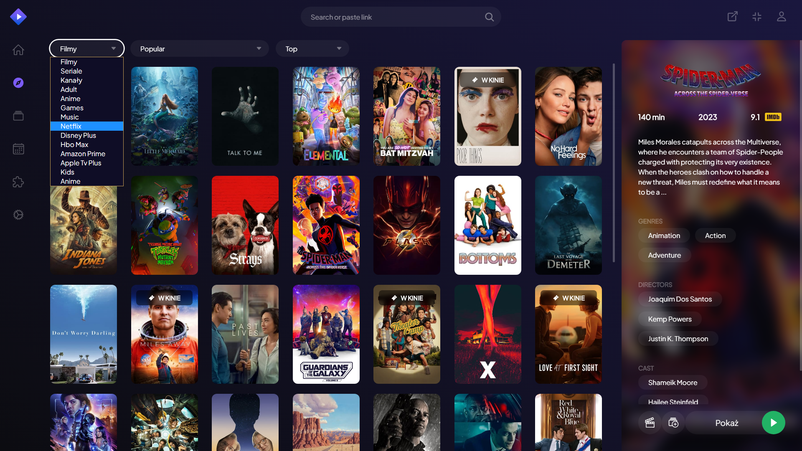
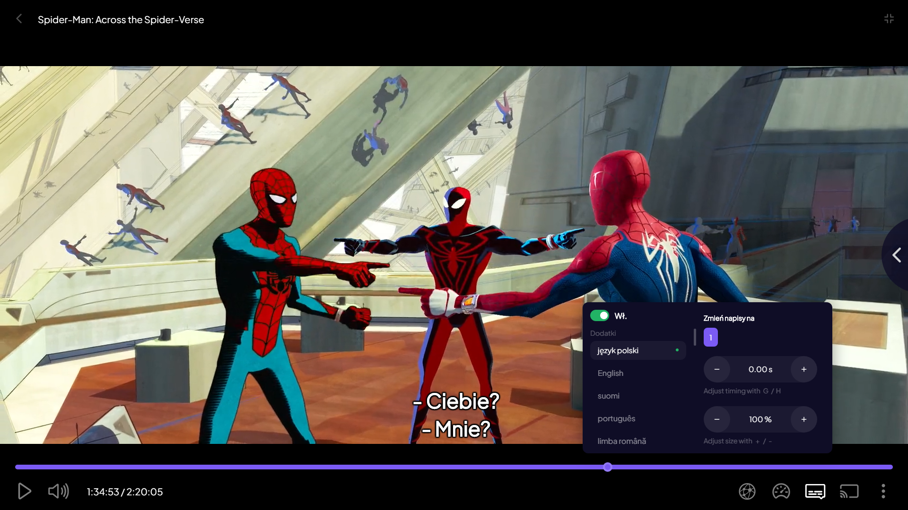

# 
✨MM_AVH MEDIA PLAYERS✨

<!-- ### _
Multimedia Magic – Audio Visual Heaven
_ -->

## Spis Treści

- [📝 Krótki Opis](#-krótki-opis)
- [📦 Zawartość](#-zawartość)
- [⚡ Instalacja Windows](#-instalacja-windows)
- [🔧 Sposób Korzystania](#-sposób-korzystania)
- [🚩 Aktualizacje](#-aktualizacje)
- [📝 Opis Programów](#-opis-programów)
- [📸 Shadery + Filtry + Interpolacja](#--shadery--filtry--interpolacja)
- [📸 VLC Dark Mode](#--vlc-dark-mode)
- [📸 MPV Modern Mode](#--mpv-modern-mode)
- [📸 SVP - Smooth Video Project](#--svp---smooth-video-project)
- [📝 Uwagi](#-uwagi)
- [📧 Kontakt](#-kontakt)
- [Instrukcja i Podstawowe Skróty Klawiszowe MPV](#instrukcja-i-podstawowe-skróty-klawiszowe-mpv)
- [Zmiany Zaproponowane Przez MM – AVH Dla MPV w Modern Mode](#zmiany-zaproponowane-przez-mm--avh-dla-mpv-w-modern-mode)

## 📝 Krótki Opis

Repozytorium ma na celu **polepszenie jakości oglądanych multimediów** poprzez zastosowanie odpowiednich **ustawień, skryptów, filtrów, shaderów, skrótów klawiszowych**, a także dodanie **nowych funkcjonalności**. Wszystko to w celu uzyskania jak najlepszych wrażeń z **oglądania filmów, seriali, animacji za darmo**.

**_UWAGA! - Autor nie ponosi odpowiedzialności za żadne szkody wyrządzone przez użytkownika, który korzysta z tego repozytorium. Wszystkie praktyki tu przedstawione mają charakter edukacyjny i to od użytkownika zależy czy i jak z nich skorzysta._**

## 📦 Zawartość

**Wykorzystuje:**

- 🎬 **VLC Media Player**
- 🎬 **MPV Media Player**
- 🎬 **Stremio Media Player**
- 🎬 **MM_AVH Media Players zawiera:**
  - ✅ VLC Media Player **Dark Mode**
  - ✅ MPV Media Player **Modern Mode:**
    - 🔥 _Shadery Skalujące, Wyostrzające, Koloryzujące_
    - 🔥 _Filtry Interpolacyjne (CPU, GPU)_
      - 🔥 _W tym SVP (Smooth Video Project | **NEW ~ ZA DARMO 3 NAJLEPSZE OPCJE**)_
    - 🔥 _Skróty Klawiszowe (Klawiatura, Mysz)_
    - 🔥 _Nowoczesny, Minimalistyczny, Intuicyjny Interfejs Wraz z Możliwością Dostosowania_
    - 🔥 _Strumieniowe Odtwarzanie Filmów, Seriali, Animacji_
  - ✅ Stremio Media Player **Biblioteka Filmów, Seriali, Animacji**
    - 🔥 _Dostęp Online_
    - 🔥 _Połączenie Wszystkich Platform Streamingowych_
    - 🔥 _Możliwość Tworzenia Bibloteki Multimediów_
    - 🔥 _Dynamiczne Wyświetlanie Torrentów_
    - 🔥 _Strumieniuje Dynamicznie Torrenty Do VLC i MPV_
    - 🔥 _Możliwość Dodawania Własnych Źródeł_
  - ✅ Porady Do **Stron z Darmowymi Filmami, Serialami, Animacjami**

## ⚡ Instalacja Windows

**Strony Programów:**

- VLC Media Player - Wymaga instalacji _([link](https://www.videolan.org/vlc/))_
- MPV Media Player - Nie wymaga instalacji _([link](https://mpv.io/installation/))_
  - Ale dla lepszego doświadczenia zalecane jest zainstalowanie
    - Umieść folder **`mpv`** w wybranej lokalizacji > Przejdź do folderu **`mpv`** i uruchom jako administrator **`mpv-install.bat`**
    - Aby odinstalować kliknij **`mpv-uninstall.bat`**
    - Teraz możliwe jest uruchamianie MPV z poziomu systemu Windows i wybranie jakko domyślnego odtwarzacza
- SVP 4 - Wymaga instalacji _([link](https://www.svp-team.com/get/))_ - Oprócz Linuxa płatne jednorazowo, ale MPV zawarłem darmowe **3 opcje: x2, 60, 120 i 170 FPS**
- Stremio
  - Stremio Media Player - Wymaga instalacji _([link](https://www.stremio.com/downloads))_
  - Stremio Media Player WEB - Nie wymaga instalacji _([link](https://web.stremio.com/))_

## 🔧 Sposób Korzystania

- **VLC Dark Mode:** Prawy przycisk myszy > Interfejs > Preferencje > Użyj własną skórkę > Wybierz plik `vlc_dark_mode.vlt` z wybranego przez siebie folderu > Zapisz > Zrestartuj VLC

- **MPV stosowanie:**

  - Możesz utworzyć skrót do pliku: **`\mpv\mpv.exe`**
  - Możesz przenieść folder **`mpv`** do **`C:\Program Files`** i używać z poziomu systemu Windows uruchamiając jako administrator **`mpv-install.bat`**

  W pliku **`input.conf` / `input_uosc.conf`** możesz modyfikować skróty klawiszowe, które są dostępne w odtwarzaczu. W tym pliku możesz również dodać własne skróty klawiszowe.

  W pliku **`mpv.conf`** możesz modyfikować ustawienia odtwarzacza tj.: bazowe ustawienia, funkcjonalności, OSD, dźwięk, wideo; skrypty, filtry, shadery automatycznie uruchamiane; napisy, zrzuty ekranu. W tym pliku możesz również dodać własne ustawienia np.:

  - Możesz zmienić `border=no` na `border=yes` w pliku aby wyświetlać górny pasek menu, gdy MPV nie odtwarza pliku.
  - Zmienić napisy m.in: **`sub-font = "Open Sans SemiBold"`** lub **`sub-font-size = 46`**
  - Możesz ustawiać ścieżkę do zapisywania zrzutów ekranu w pliku **`screenshot-template = "~~desktop/MPV Screens/MPV-%F-%wH.%wM.%wS.%wT-F%{estimated-frame-number}"`**
  - Możesz też dodawać własne filtry i rozszerzenia np.: poprzez język skryptów Lua.

- **SVP 4 - Podczas instalacji**: Wybierz opcję z odpowiednim odtwarzaczem np. MPV lub VLC. W przypadku MPV, w trakcie instalacji SVP 4, należy wybrać w ustawieniach SVP 4 opcję **`MPV (64-bit)`**.
- W folderze instalacji SVP 4 **`C:\Program Files (x86)\SVP 4`** znajdują się 2 foldery: **mpv32 i mpv64**, można je usunąć lub przekopiować do nich jeden z wybranych wersji MPV **modern**, znajdujących się na w tym repozytorium w folderach **`mpv`**.

- **Stremio Media Player** - [Instrukcja](./stremio/Stremio%20-%20INSTRUKCJA.txt)

Zalecane jest dostosowanie ustawień do swoich preferencji.

## 🚩 Aktualizacje

- YouTube .dlp: [https://github.com/yt-dlp/yt-dlp](https://github.com/yt-dlp/yt-dlp)

## 📝 Opis Programów

**VLC i MPV** to dwa popularne odtwarzacze multimediów. Oba programy oferują wiele możliwości, ale różnią się między sobą w kilku aspektach.

**VLC** jest uniwersalnym odtwarzaczem, który obsługuje praktycznie wszystkie formaty **audio i wideo**. Ma intuicyjny **interfejs graficzny** użytkownika i jest łatwy w obsłudze, co czyni go idealnym wyborem dla **początkujących użytkowników**. Oferuje również wiele zaawansowanych opcji, takich jak streamowanie, konwertowanie i zapisywanie strumieni. Ponadto jest dostępny na **wiele systemów operacyjnych**, w tym Windows, Linux, Mac OS X i Android.

**MPV** z kolei skupia się przede wszystkim na odtwarzaniu **wideo**, oferując **wiele zaawansowanych funkcji**, takich jak manipulacja prędkością odtwarzania, ładowanie napisów czy efekty wideo. MPV ma bardzo prosty **wiersza poleceń** i posiada **minimalny interfejs użytkownika**. Jest to program dedykowany **bardziej zaawansowanym użytkownikom**, którzy chcą dostosować niemal każdy aspekt działania odtwarzacza.

MPV posiada **w pełni konfigurowalną, sterowaną poleceniami warstwę sterowania**, która pozwala na sterowanie MPV za pomocą klawiatury, myszy lub pilota zdalnego sterowania. MPV obsługuje wiele różnych wyjść wideo i audio oraz metody, w zależności od platformy. MPV **może odczytywać dane wejściowe z różnych źródeł**, a także obsługuje specjalny wejściowy **adres URL** umożliwiający odczyt danych wejściowych z innych źródeł niż dysk plików. MPV posiada wiele **skrótów klawiszowych** umożliwiających **kontrolowanie odtwarzania wideo i audio**, a także dostępne są opcje **zmiany koloru**.

Podsumowując, **VLC i MPV** to dwa różne odtwarzacze, które mogą być używane w zależności od potrzeb użytkownika. **VLC** jest **uniwersalnym** odtwarzaczem, który jest łatwy w obsłudze i oferuje wiele zaawansowanych opcji. **MPV** natomiast jest bardziej **zaawansowany i konfigurowalny**, co czyni go idealnym wyborem dla użytkowników, którzy chcą dostosować odtwarzacz do swoich potrzeb, a także dla tych, którzy chcą uzyskać **lepszą jakość wideo**.

**SVP (Smooth Video Project)** to program do poprawy płynności odtwarzanych wideo poprzez **zwiększenie liczby klatek na sekundę (FPS)**. SVP działa jako wtyczka dla odtwarzaczy wideo takich jak **VLC, MPV, MPC-HC czy PotPlayer** i korzysta z **technologii interpolacji klatek**, aby wideo wyglądało bardziej płynnie. Dzięki temu filmy odtwarzane są z większą ilością klatek, co pozwala na uzyskanie efektu zbliżonego do tego, jakbyśmy oglądali je na żywo. Program oferuje również szereg innych funkcji, takich jak **redukcja drgań kamery, korekcja kolorów, czy skalowanie obrazu**. SVP jest dostępny w wersji **darmowej oraz płatnej**, która oferuje dodatkowe funkcje i wsparcie techniczne.

**Stremio Media Player** to program do odtwarzania filmów, seriali i animacji. Program oferuje **dostęp do wielu platform streamingowych**, takich jak Netflix, HBO GO, Amazon Prime Video, Hulu, YouTube, Twitch i wiele innych. Stremio pozwala również na **dodawanie własnych źródeł** i **tworzenie własnej biblioteki multimediów**. Program oferuje również **dynamiczne wyświetlanie torrentów** i **strumieniowanie torrentów do VLC i MPV**.

## ❓ Tutoriale i Inspiracje

- Tutorial: **WKRÓTCE**
- MPV_lazy: https://github.com/hooke007/MPV_lazy
- SmartCopyPaste: https://github.com/Eisa01/mpv-scripts#smartcopypaste-script
- K7SFUNC: https://github.com/hooke007/MPV_lazy/wiki/3_K7sfunc
- Inspiracja: https://github.com/adriabama06/Preconfigured-MPV#readme
- MPV ustawienia edytowane z: https://github.com/Tsubajashi/mpv-settings
- VapourSynth-RIFE-ncnn-Vulkan: https://github.com/HomeOfVapourSynthEvolution/VapourSynth-RIFE-ncnn-Vulkan/releases
- VapourSynth-RIFE-ncnn-Vulkan R3: https://github.com/HomeOfVapourSynthEvolution/VapourSynth-RIFE-ncnn-Vulkan/releases/tag/r3
- Anime4K: https://github.com/bloc97/Anime4K

## 👀 Demonstracja

## 
 🎬 Shadery + Filtry + Interpolacja

### 
 [Link do Wideo](https://mattymroz.github.io/mm_avh_media_players/)

---

## 
 📸 VLC Dark Mode

---

## 
 📸 MPV Modern Mode

## 
 Shadery

### 
 Obraz Oryginalny:

### 
Włączone Shadery:

### 
Zmiana Kolorów - Tryb Walki:

### 
Zmiana Kolorów - Tryb Sportowy:

---

## 
 📸 SVP - Smooth Video Project

### 
Dark Mode

---

## 
 📸 Stremio Media Player

## 📝 Uwagi

**MM_AVH Media Players** to zestaw trzech popularnych odtwarzaczy multimedialnych, które oferują wiele możliwości. Programy te różnią się między sobą w kilku aspektach, co pozwala użytkownikom na wybór odpowiedniego odtwarzacza dla swoich potrzeb. Warto dodać, że **MM_AVH Media Players** zawierają dodatkowe skiny, skrypty, filtry, shadery i programy, które pozwalają na dostosowanie odtwarzaczy do własnych preferencji. Mimo pewnych niedociągnięć programy te stanowią dobry wybór dla użytkowników poszukujących uniwersalnych i konfigurowalnych odtwarzaczy multimedialnych.

## 📧 Kontakt

[📧 mateuszmroz001@mail.com](mailto:mateuszmroz001@mail.com)

---

## Instrukcja i Podstawowe Skróty Klawiszowe MPV

[Manual Online](https://mpv.io/manual/master)
[Manual PDF](/mpv/doc/manual.pdf)

| Skrót klawiszowy                            | Funkcja                                                                                                  |
| ------------------------------------------- | -------------------------------------------------------------------------------------------------------- |
| Strzałka w lewo                             | Przewiń wstecz o 5 sekund.                                                                               |
| Strzałka w prawo                            | Przewiń do przodu o 5 sekund.                                                                            |
| Strzałka w dół                              | Przewiń wstecz o 1 minutę.                                                                               |
| Strzałka w górę                             | Przewiń do przodu o 1 minutę.                                                                            |
| Shift + Page Up                             | Przewiń do przodu o 10 minut.                                                                            |
| Shift + Page Down                           | Przewiń wstecz o 10 minut.                                                                               |
| Page Up                                     | Przejdź do początku następnego rozdziału.                                                                |
| Page Down                                   | Przejdź do początku poprzedniego rozdziału.                                                              |
| Ctrl + Strzałka w lewo                      | Przejdź do poprzedniej klatki z napisami.                                                                |
| Ctrl + Strzałka w prawo                     | Przejdź do następnej klatki z napisami.                                                                  |
| V                                           | Wyświetl lub ukryj napisy dla aktualnie odtwarzanego pliku.                                              |
| Shift + J                                   | Wybierz poprzedni plik z napisami.                                                                       |
| J                                           | Wybierz następny plik z napisami.                                                                        |
| Ctrl + Shift + Strzałka w lewo              | Synchronizuj napisy z poprzednią klatką.                                                                 |
| Ctrl + Shift + Strzałka w prawo             | Synchronizuj napisy z następną klatką.                                                                   |
| Z                                           | Zwiększ opóźnienie napisów o 100 milisekund.                                                             |
| Shift + Z                                   | Zmniejsz opóźnienie napisów o 100 milisekund.                                                            |
| Shift + G                                   | Zwiększ rozmiar czcionki napisów o 10%.                                                                  |
| Shift + F                                   | Zmniejsz rozmiar czcionki napisów o 10%.                                                                 |
| R                                           | Przesuń położenie napisów wideo w górę.                                                                  |
| Shift + R                                   | Przesuń położenie napisów wideo w dół.                                                                   |
| U                                           | Przełącz na aktualnie aktywny napis w kompatybilnym formacie SubStation Alpha.                           |
| [                                           | Spowolnij odtwarzanie pliku o 10%.                                                                       |
| ]                                           | Przyspiesz odtwarzanie pliku o 10%.                                                                      |
| Shift + [                                   | Zmniejsz prędkość odtwarzania o 50%.                                                                     |
| Shift + ]                                   | Zwiększ prędkość odtwarzania o 50%.                                                                      |
| L                                           | Oznacz bieżącą pozycję jako pętlę odtwarzania.                                                           |
| Shift + L                                   | Utwórz nieskończoną pętlę między dwoma oznaczonymi punktami.                                             |
| Backspace                                   | Przywróć standardową prędkość odtwarzania pliku.                                                         |
| / lub 9                                     | Zmniejsz głośność o 1 punkt.                                                                             |
| \* lub 0                                    | Zwiększ głośność o 1 punkt.                                                                              |
| M                                           | Wycisz dźwięk obecnie odtwarzanego pliku.                                                                |
| Shift + `                                   | Przełącz między dostępnymi ścieżkami wideo w pliku multimedialnym.                                       |
| Shift + 3                                   | Przełącz między dostępnymi ścieżkami audio w pliku multimedialnym.                                       |
| S                                           | Zapisz obecny klatkę wideo jako zrzut ekranu.                                                            |
| Shift + S                                   | Zrób zrzut ekranu obecnej klatki i usuń wszystkie napisy.                                                |
| Ctrl + S                                    | Zrób zrzut ekranu obecnego okna odtwarzacza.                                                             |
| Ctrl +                                      | Zwiększ opóźnienie dźwięku o 100 milisekund.                                                             |
| Ctrl –                                      | Zmniejsz opóźnienie dźwięku o 100 milisekund.                                                            |
| Shift + A                                   | Wymuś inny proporcje obrazu dla obecnie odtwarzanego pliku.                                              |
| D                                           | Przełącz tryb deinterlace dla wideo w czasie rzeczywistym.                                               |
| 1                                           | Zmniejsz kontrast wideo.                                                                                 |
| 2                                           | Zwiększ kontrast wideo.                                                                                  |
| 3                                           | Zmniejsz jasność wideo.                                                                                  |
| 4                                           | Zwiększ jasność wideo.                                                                                   |
| 5                                           | Zmniejsz gamma wideo.                                                                                    |
| 6                                           | Zwiększ gamma wideo.                                                                                     |
| 7                                           | Zmniejsz nasycenie wideo.                                                                                |
| 8                                           | Zwiększ nasycenie wideo.                                                                                 |
| Ctrl + H                                    | Włącz obsługę dekodowania sprzętowego.                                                                   |
| Shift + W                                   | Zwiększ przycięcie obrazu dla obecnie odtwarzanego pliku.                                                |
| W                                           | Zmniejsz przycięcie obrazu dla obecnie odtwarzanego pliku.                                               |
| Alt + strzałka w górę                       | Przesuń obraz w górę.                                                                                    |
| Alt + strzałka w dół                        | Przesuń obraz w dół.                                                                                     |
| Alt + strzałka w lewo                       | Przesuń obraz w lewo.                                                                                    |
| Alt + strzałka w prawo                      | Przesuń obraz w prawo.                                                                                   |
| Alt +                                       | Powiększ obecnie odtwarzany plik multimedialny.                                                          |
| Alt –                                       | Pomniejsz obecnie odtwarzany plik multimedialny.                                                         |
| Alt + Backspace                             | Przywróć oryginalną pozycję i powiększenie obrazu.                                                       |
| Enter lub Player Controls                   | Odtwórz następny plik w liście odtwarzania.                                                              |
| <                                           | Odtwórz poprzedni plik w liście odtwarzania.                                                             |
| P lub Spacja                                | Włącz/wyłącz pauzę odtwarzania.                                                                          |
| .                                           | Wstrzymaj odtwarzanie i wyświetl następny klatkę.                                                        |
| ,                                           | Wstrzymaj odtwarzanie i wyświetl poprzednią klatkę.                                                      |
| F                                           | Przełącz odtwarzacz w tryb pełnoekranowy.                                                                |
| Esc                                         | Przywróć odtwarzacz do pierwotnego rozmiaru.                                                             |
| T                                           | Zmusz odtwarzacz do pozostania na wierzchu innych okien.                                                 |
| O lub Shift + P                             | Wyświetl pasek postępu dla bieżącego pliku.                                                              |
| I lub Shift + I                             | Wyświetl szczegółowe informacje o technicznych parametrach bieżącego pliku na ekranie.                   |
| \`                                          | Wstrzymaj odtwarzanie i wyświetl poprzednią klatkę.                                                      |
| Q                                           | Zatrzymaj odtwarzanie bieżącego pliku i wyjdź z odtwarzacza.                                             |
| Shift + Q                                   | Zatrzymaj odtwarzanie bieżącego pliku, zapisz jego pozycję odtwarzania, a następnie wyjdź z odtwarzacza. |
| Kontrolki myszy                             |                                                                                                          |
| Prawy przycisk myszy                        | Przełącz funkcję pauzy.                                                                                  |
| Podwójne kliknięcie lewym przyciskiem myszy | Przełącz odtwarzacz w tryb pełnoekranowy.                                                                |
| Przewijanie w górę                          | Przewiń do przodu o 10 sekund w pliku multimedialnym.                                                    |
| Przewijanie w dół                           | Przewiń do tyłu o 10 sekund w pliku multimedialnym.                                                      |

## Zmiany Zaproponowane Przez MM – AVH Dla MPV w Modern Mode

| Skrót klawiszowy                                  | Funkcja                                                                                                          |
| ------------------------------------------------- | ---------------------------------------------------------------------------------------------------------------- |
| Menu                                              | Otwórz Plik Multimedialny > ※ Otwórz Plik                                                                        |
| Menu                                              | Otwórz Plik Multimedialny > ※ Dodaj Plik z Napisami                                                              |
| Menu                                              | Nawigacja > ※ Lista Odtwarzania                                                                                  |
| Menu                                              | Nawigacja > ※ Lista Wersji                                                                                       |
| Menu                                              | Nawigacja > ※ Lista Rozdziałów                                                                                   |
| Menu                                              | Nawigacja > ※ Lista Ścieżek Wideo                                                                                |
| Menu                                              | Nawigacja > ※ Lista Ścieżek Dźwiękowych                                                                          |
| Menu                                              | Nawigacja > ※ Lista Ścieżek Napisów                                                                              |
| Menu                                              | Nawigacja > Losowa Lista Odtwarzania                                                                             |
| ,                                                 | Odtwarzanie > Poprzednia Klatka                                                                                  |
| .                                                 | Odtwarzanie > Następna Klatka                                                                                    |
| l                                                 | Odtwarzanie > Ustaw / Czyść Punkty Pętli AB                                                                      |
| [                                                 | Odtwarzanie > Prędkość -0.1                                                                                      |
| ]                                                 | Odtwarzanie > Prędkość +0.1                                                                                      |
| Backspace                                         | Odtwarzanie > Prędkość = 1x                                                                                      |
| \                                                 | Odtwarzanie > Prędkość = 2x                                                                                      |
| -                                                 | Odtwarzanie > Zmniejsz Głośność -2                                                                               |
| =                                                 | Odtwarzanie > Zwiększ Głośność +2                                                                                |
| c                                                 | Odtwarzanie > Opóźnij dźwięk -100 ms                                                                             |
| v                                                 | Odtwarzanie > Przyspiesz dźwięk +100 ms                                                                          |
| z                                                 | Odtwarzanie > Opóźnij Napisy -100 ms                                                                             |
| x                                                 | Odtwarzanie > Przyspiesz Napisy +100 ms                                                                          |
| Shift+Backspace                                   | Odtwarzanie > Przywróć Synchronizację Dźwięku i Napisów                                                          |
| ~                                                 | Filtr Wideo > Wyłącz Interpolację                                                                                |
| !                                                 | Filtr Wideo > (CPU) MVTools_x2                                                                                   |
| @                                                 | Filtr Wideo > (CPU) MVTools_60                                                                                   |
| #                                                 | Filtr Wideo > (CPU) MVTools_120                                                                                  |
| $                                                 | Filtr Wideo > (GPU) MVTools_170                                                                                  |
| %                                                 | Filtr Wideo > (GPU) MEMC_SVP_x2                                                                                  |
| ^                                                 | Filtr Wideo > (GPU) MEMC_SVP_60                                                                                  |
| &                                                 | Filtr Wideo > (GPU) MEMC_SVP_120                                                                                 |
| \*                                                | Filtr Wideo > (GPU) MEMC_SVP_170                                                                                 |
| (                                                 | Filtr Wideo > (GPU) RIFE_480p_x2                                                                                 |
| )                                                 | Filtr Wideo > (GPU) RIFE_720_2x                                                                                  |
| _                                                 | Filtr Wideo > (GPU) RIFE_1080p_x2                                                                                |
| Ctrl+`                                            | Shader > Wyłącz Shader                                                                                           |
| Ctrl+1                                            | Shader > On / Off - KrigBilateral                                                                                |
| Ctrl+2                                            | Shader > On / Off - AMD_FSR_rgb                                                                                  |
| Ctrl+3                                            | Shader > On / Off - Anime4K_Restore_CNN_L                                                                        |
| Ctrl+4                                            | Shader > On / Off - Anime4K_Upscale_GAN_x2_M                                                                     |
| Ctrl+5                                            | Shader > On / Off - Adaptive_Sharpen                                                                             |
| Ctrl+6                                            | Shader > On / Off - Nneid3_128_8x4                                                                               |
| Ctrl+7                                            | Shader > On / Off - FSRCNNX_x2_16                                                                                |
| Ctrl+s                                            | ※ Zrzut Ekranu                                                                                                   |
| Menu                                              | Wideo > Tryb Dekodowania                                                                                         |
| Menu                                              | Wideo > Tryb Usuwania Pasów Kolorów                                                                              |
| Menu                                              | Wideo > Tryb Usuwania Przeplotu                                                                                  |
| Menu                                              | Wideo > Tryb Automatyczna Korekcja Kolorów                                                                       |
| Menu                                              | Wideo > Tryb Analizy Kodów Czasowych                                                                             |
| 1                                                 | Wideo > Filtr > Kontrast -                                                                                       |
| 2                                                 | Wideo > Filtr > Kontrast +                                                                                       |
| 3                                                 | Wideo > Filtr > Jasność -                                                                                        |
| 4                                                 | Wideo > Filtr > Jasność +                                                                                        |
| 5                                                 | Wideo > Filtr > Gamma -                                                                                          |
| 6                                                 | Wideo > Filtr > Gamma +                                                                                          |
| 7                                                 | Wideo > Filtr > Nasycenie Kolorów -                                                                              |
| 8                                                 | Wideo > Filtr > Nasycenie Kolorów +                                                                              |
| 9                                                 | Wideo > Filtr > Barwa -                                                                                          |
| 0                                                 | Wideo > Filtr > Barwa +                                                                                          |
| Ctrl+9                                            | Wideo > Filtr > Tryb Walki!                                                                                      |
| Ctrl+0                                            | Wideo > Filtr > Tryb Sport!                                                                                      |
| Ctrl+Backspace                                    | Wideo > Filtr > Wyłącz Filtry Kolorów                                                                            |
| I                                                 | Narzędzia > Wyświetl Statystyki Dla Nerdów                                                                       |
| `                                                 | Narzędzia > Wyświetl Konsolę                                                                                     |
| Ctrl+r                                            | Narzędzia > Wyczyść Zarejestrowane Wartości Atrybutów                                                            |
| Menu                                              | Narzędzia > Zmień Obramowanie Okna                                                                               |
| Menu                                              | Narzędzia > Tryb Okno Zawsze na Wierzchu                                                                         |
| Menu                                              | Narzędzia > ※ Lista Urządzeń Wyjściowych Audio                                                                   |
| Menu                                              | Narzędzia > ※ Jakość Strumieniowania                                                                             |
| Menu                                              | Narzędzia > ※ Otwórz Bieżący Folder Pliku                                                                        |
| Menu                                              | Narzędzia > ※ Otwórz Folder Ustawień                                                                             |
| Menu                                              | Zatrzymaj                                                                                                        |
| Ctrl+q                                            | Wyjdź                                                                                                            |
| POWER                                             | Wyjdź                                                                                                            |
| PLAY                                              | Odtwarzaj                                                                                                        |
| PAUSE                                             | Pauza                                                                                                            |
| PLAYPAUSE                                         | Pauza / Odtwarzaj                                                                                                |
| STOP                                              | Zatrzymaj                                                                                                        |
| REWIN                                             | Przewiń do przodu o 30 sekund                                                                                    |
| FORWARD                                           | Przewiń do tyłu o 30 sekund                                                                                      |
| PREV                                              | Poprzedni Film                                                                                                   |
| NEXT                                              | Następny Film                                                                                                    |
| MBTN_BACK                                         | Poprzedni Film                                                                                                   |
| MBTN_FORWARD                                      | Następny Film                                                                                                    |
| MBTN_LEFT                                         | Ignoruj                                                                                                          |
| MBTN_LEFT_DBL                                     | Przełącz Tryb Pełnoekranowy                                                                                      |
| MBTN_RIGHT                                        | Wyświetl Menu                                                                                                    |
| MBTN_RIGHT_DBL                                    | Ignoruj                                                                                                          |
| WHEEL_DOWN                                        | Zmniejsz Głośność o 2 dB                                                                                         |
| WHEEL_UP                                          | Zwiększ Głośność o 2 dB                                                                                          |
| ESC                                               | Wyłącz Tryb Pełnoekranowy                                                                                        |
| ENTER                                             | Włącz Tryb Pełnoekranowy                                                                                         |
| Alt+ENTER                                         | Przełącz Tryb Pełnoekranowy                                                                                      |
| SPACE                                             | Pauza / Odtwarzaj                                                                                                |
| DOWN                                              | Przewiń do tyłu o 30 sekund                                                                                      |
| UP                                                | Przewiń do przodu o 30 sekund                                                                                    |
| LEFT                                              | Przewiń do tyłu o 5 sekund                                                                                       |
| RIGHT                                             | Przewiń do przodu o 5 sekund                                                                                     |
| f                                                 | Przełącz Tryb Pełnoekranowy                                                                                      |
| m                                                 | Przełącz Tryb Wyciszenia                                                                                         |
| Shift+RIGHT                                       | Przewiń do przodu o 1 klatkę                                                                                     |
| Shift+LEFT                                        | Przewiń do tyłu o 1 klatkę                                                                                       |
| Ctrl+c / Ctrl+C / Meta+c / Meta+C                 | Kopiuj ścieżkę pliku / URI z czasem wznawiania używając skonfigurowanego inteligentnego zachowania               |
| Ctrl+v / Ctrl+V / Meta+v / Meta+V                 | Wklej i uruchom do odtwarzacza mpv z schowka używając skonfigurowanego inteligentnego zachowania                 |
| Ctrl+Alt+c / Ctrl+Alt+C / Meta+Alt+c / Meta+Alt+C | Kopiuj ścieżkę pliku bez osiągniętego czasu lub zgodnie ze skonfigurowanym specyficznym zachowaniem kopiowania   |
| Ctrl+Alt+v / Ctrl+Alt+V / Meta+Alt+v / Meta+Alt+V | Wklej i dołącz plik wideo do listy odtwarzania lub zgodnie ze skonfigurowanym specyficznym zachowaniem wklejania |
